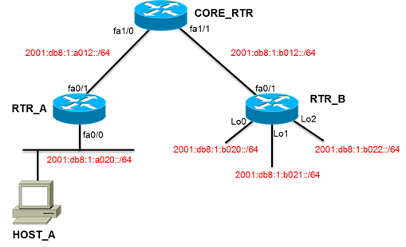
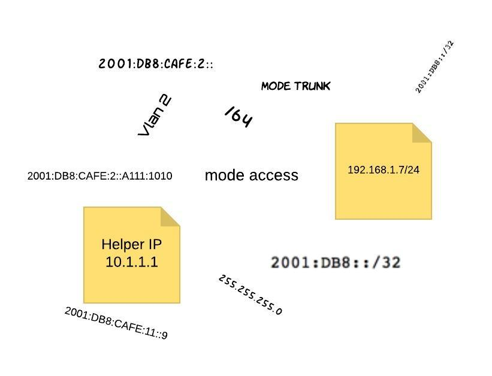
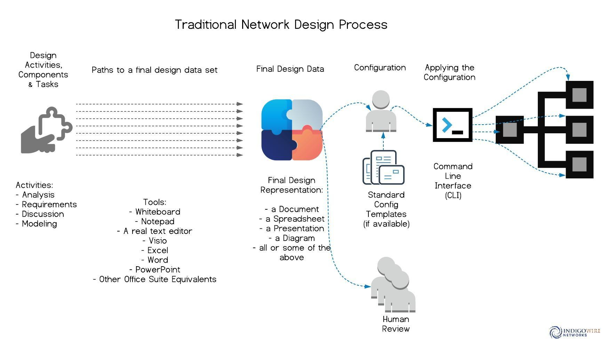
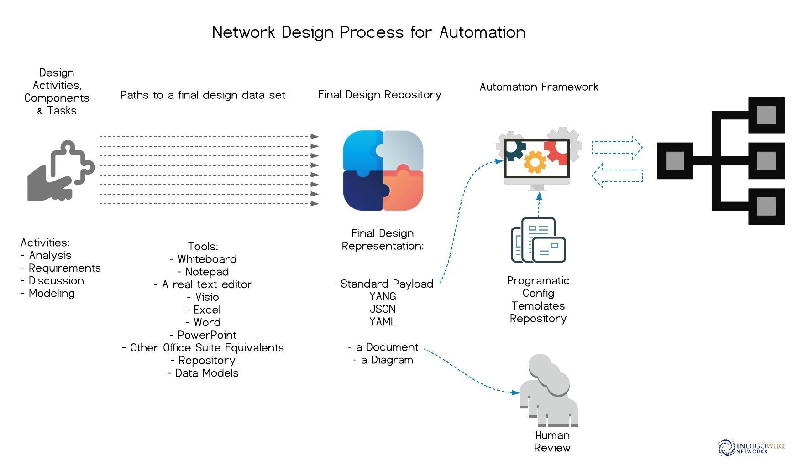

# The Struggle with Structure

##### Preface

Modern enterprise networking is going to require a level of structure and consistency that the majority of its networking community may find unfamiliar and perhaps uncomfortable.    As a community, we've never had to present our designs and configuration data in any kind of globally consistent or even industry standard format.   

I'm fascinated by all things relating to network automation but the one thing that eluded me was the discussion around data models (YANG, OpenConfig).   

Early on, the little I researched led me to conclude that it was interesting, perhaps something more relevant to the service provider community, and a bit academic.  In short, not something directly relevant to what I was doing.  

Here is how I figured out that nothing could be further from the truth and why I think this is an area that needs even more focus.

If you want to skip my torturous joruney towards the obvious, see the resources section at the end or jump over to [Cisco's DevNet Model Driven Programmability](https://developer.cisco.com/site/standard-network-devices/) for some excellent material.

---

Since its earliest days as a discipline, networking (at least in the enterprise) has generally allowed quite a bit of freedom in the design process and its resulting documentation.   That is one of the things I love about it and I'm certain I'm not alone in that feeling. A little island of creativity in an ocean of the technical.  

For every design, I put together my own diagrams, my own documentation, and my own way to represent the configuration or just the actual configuration.  Organizations tried to put some structure around that with a Word or Visio Template, but often even that was mostly just for the purposes of branding and identification of the material.  How many of us have been given a Word template with the appropriate logos on the title page and if you were lucky a few headings?  Many organizations certainly went further requiring a specific format and structure so that there was consistency within the organization but move on to a different organization and everything was different.


The resulting design documentation sets were many and varied and, to a large degree, locally significant.  

In effect, the result was unstructured data.   Unstructured or even semi structured data as text or standard output from a device or system is well know but this is unstructured data on a broader scale.

### Design and Configuration Data

Over the last few years I've observed a pattern that I'm just now able to articulate.  This pattern speaks to the problem of unstructured design and configuration data.  The first thing I realized is that, as usual, I'm late to the party.  Certainly the IETF has been working on the structured configuration data problem for almost 20 years and longer if you include SNMP!  

The problem of structured vs unstructured data has been well documented over the years.   Devin Pickell describes this in great detail in his [Structured vs Unstructured Data – What's the Difference?](https://learn.g2.com/structured-vs-unstructured-data) post.

For the purposes of this discussion let me summarize.

We have a template that we need to customize with specific configuration values for a specific device:

```
!EXAMPLE SVI Template <configuration item to be replaced with actual value>

  interface Vlan< Vlan ID >
  description < SVI description >
  ipv6 address < IP Address >/< IP MASK>
  ipv6 nd prefix < Prefix >/< Prefix MASK > 0 0 no-autoconfig
  ipv6 nd managed-config-flag
  ipv6 dhcp relay destination < DHCP6 Relay IP >
```

If we are lucky we have this:

/scripts/articles/2019/Struggle_with_Structure/images/image-20190719130841233.png)

More often than not we have this:





Or this:



The problem is a little broader but I think this very specific example illustrates the bigger issue.  Today there is no one standard way to represent our network design and configuration data.  A diagram (in Visio typically) is perhaps the de-facto standard but its not very automation friendly.  I've had design and configuration data handed to me in Word, PowerPoint, Excel (and their open source equivalents), Visio, and the PDF versions of all of those.

Let me be clear. I am not advocating one standard way to document an entire network design set (just the configuration data).  I'm suggesting that automation will drive a standard way to represent configuration data and ***that*** should drive the resulting design documentation set in whatever form the humans need it.  

## Structured design and configuration data

In order to leverage automation we need the configuration data presented in a standard format.  I'm not talking configuration templates but rather the actual data that feeds those templates and generates a specific configuration for a specific device.  

Traditionally, when developing a design you were usually left to your own devices as to how to go about doing that.  In the end, you likely had to come up with a way to document the design for review and approval of some sort but that documentation was static (hand entered) and varied in format.  Certainly not something that could be easily ingested by any type of automation.   So over the last few years, I've developed certain structured ways to represent what I will call the "configuration payload"...all the things you need to build a specific working configuration for a device and to define the state it should be in.

Configuration payload includes:

- hostname
- authentication and authorization
- timezone
- management configuration (NTP, SNMP, Logging, etc.)
- interface configuration (ip, mask, description, routed, trunked, access, and other attributes)
- routing configuration (protocol, id, networks, neighbors, etc.)

All of this data in a format that could be consumed by automation.  My experience over the last few years tells me we have some work ahead of us to achieve that goal.

## The problem - Unstructured design and configuration data

As a consultant you tend to work with lots of different network engineers and client engineering teams.   I started focusing on automation over 4 years ago and during that time I've seen my share of different types of configuration payload data.  I'm constantly saying, if you can give me this data in a specific format, look what can be done with it!

My first memorable example of this problem was over 2 years ago.  The client at the time had a very particular format that they wanted followed to document their wireless design and the deliverable had to be in Visio.  I put together a standard format in Excel for representing access point data (name, model, and other attributes).  This structured data set in Excel (converted to CSV) would then allow you to feed that data into a diagram that had a floor plan.  You still had to move the boxes with the data around to where the APs were placed but it saved quite a lot of typing (and time) and reduced errors.  I demonstrated the new workflow but the team felt that it would be simpler for them to stick to the old manual process.   I was disappointed to be sure but it was a bit of a passion project to see how much of that process I could automate. Its important to point out that this was not even configuration payload but documentation!

The issue was more acute on the LAN side of the house.  On the LAN side the structured documentation format (also in Excel) was not an option.   It fed all the subsequent stages of the process including ordering hardware, configurations (this time it was configuration payload!), staging, QA, and the final documentation deliverable.  

When fellow network engineers were presented with the format we needed to use, lets just say, the reception lacked warmth.  I used Excel specifically because I thought it would be less intimidating and nearly everyone has some familiarity with Excel.   These seasoned, well credentialed network engineers, many who were CCIEs, struggled.   I struggled right along with them…they could not grasp why we had to do things this way and I struggled to understand why it was such an issue.  It is what we all do as part of network design…just the format was a little different, a little more structured (in my mind anyway).

I figured I had made the form too complicated and so I simplified it.   The struggle continued.  I developed a JSON template as an alternative.  I think that made it worse.  The feedback had a consistent theme.  "I don't usually do it that way."  "I've never done it this way before."  "This is confusing." "This is complicated."  

Lets be clear, at the end of the day we were filling in hostname, timezone information, vlans, default gateway, SVI IP/Mask,  uplink Interface configuration, and allowed vlans for the uplinks.  These were extremely capable network engineers.   I wasn't asking them to do anything they couldn't do half asleep.  I was only requiring a certain format for the data!   

During these struggles I started working with a young engineer who had expressed an interest in helping out with the automation aspects of the project.   He grasped the structured documentation format (aka the Excel spreadsheet) in very little time!     So much so, that he took on the task of training the seasoned network engineers.   So it wasn't the format or it wasn't **just** the format if an inexperienced recent graduate could not just understand it, but master it enough to teach it to others.

With that, the pieces fell into place for me.  What I was struggling against was **years of tradition and learned behavior**.  Years of a tradition where the configuration payload format was arbitrary and irrelevant.  All you needed was your Visio diagram and you were good to go.  



Unstructured configuration payload data in a variety of formats (often static and binary) is of little use in this brave new world of automation and I started connecting the dots.   YANG to model data, Vendor Yang data models…OK…I get it now.   These are ways to define the configuration payload for a device in a structured way that is easily consumed by "units of automation".

This does not solve the broader issue of unlearning years of behavior but it does allow for the learning of a process that has one standard method of data representation.  So if that transition can be made I can get out of the data modeling business (that is in fact what I was trying to do with the structured documentation format) and there is now a standard way to represent the data and a single language we can use to talk about it.   That is of course the ideal.  I suspect I'm not out of the data modeling business just yet but I'm certainly a step closer to being out of it and most importantly understanding the real issue.



The diagram above shows an evolution of the network design process.  The initial design activities won't change much.  We are always going to need to:

- Understand the business needs, requirements, and constraints
- Analyze the current stage
- Develop solutions perhaps incorporating new technology or design options using different technologies
- Model the new design
- Present & Review the new design

In this next evolution, we may use many of the old tools, some in new ways.  As we document requirements in a repository and configuration payload in a data model, those artifacts can now drive:

- An automated packaging effort to generate the design information in human readable formats that each organization wants see
  - Here the Word and PowerPoint and Diagram are an output of  the configuration payload captured in the data model
- The actual configuration of the network via an automation framework since by definition our data models can be consumed by automation.

As with any major technology shift, paradigm change, call it what you will, the transition will likely result in three general communities.

1. Those who eagerly adopt, evangelize, and lead the way
2. Those who accept and adapt to fit within the new model
3. Those who will not adapt

I'm sorry to say I've been wholly focused on the first community until now.  It is this second "adapt community", which will arguably be the largest of the three, that needs attention.  These will be the network engineers who understand the benefits of automation and are willing to adapt but at least initally will likely not be the ones evangelizing or contributing directly to the automation effort.  They will be the very capable users and consumers of it.  

We need to better target skills development for them as the current landscape can be overwhelming.

#### What's next?

The solution may elude us for a while and may change over time.   For me at least the next steps are clear.  

- I need to do a better job of targeting the broader network community who isn't necessarily exited (yet) about all the automation but is willing to adapt.  
- I will start discussing and incorporating data models into the conversations and documentation products with my new clients and projects.
- I will start showcasing the benefits of this approach in every step of the design process and how it can help improve the overall product.   
  - revision control 
  - improved accuracy
  - increased efficiency

#### Don't miss these resources

Always a fan of DevNet, the DevNet team once again does not disappoint.

- [DevNet:  Getting the "YANG" of it with Standard Data Models](https://developer.cisco.com/video/net-prog-basics/02-network_device_apis/yang)
- [DevNet:  Model Driven Programmability](https://developer.cisco.com/site/standard-network-devices/))


[YANG for Dummies by David Barroso](https://napalm-automation.net/yang-for-dummies/)

[YANG Opensource Tools for Data Modeling-driven Management by Benoit Claise](https://blogs.cisco.com/getyourbuildon/yang-opensource-tools-for-data-modeling-driven-management)

[YANG Modules Overview from Juniper Networks Protocol Developer Guide](https://www.juniper.net/documentation/en_US/junos/topics/concept/netconf-yang-modules-overview.html)

[YANG and the Road to a Model Driven Network by Karim Okasha](https://medium.com/@k.okasha/yang-and-road-to-a-model-driven-network-e9e52d47148d)


The OpenConfig group bears watching as they are working on vendor agnostic real world models using the YANG language.   This is very much a Service Provider focused initiative whose efforts may be prove very useful in the Enterprise space.

[OpenConfig Site](http://www.openconfig.net/)

[OpenConfig GitHub Repository](https://github.com/openconfig/public)